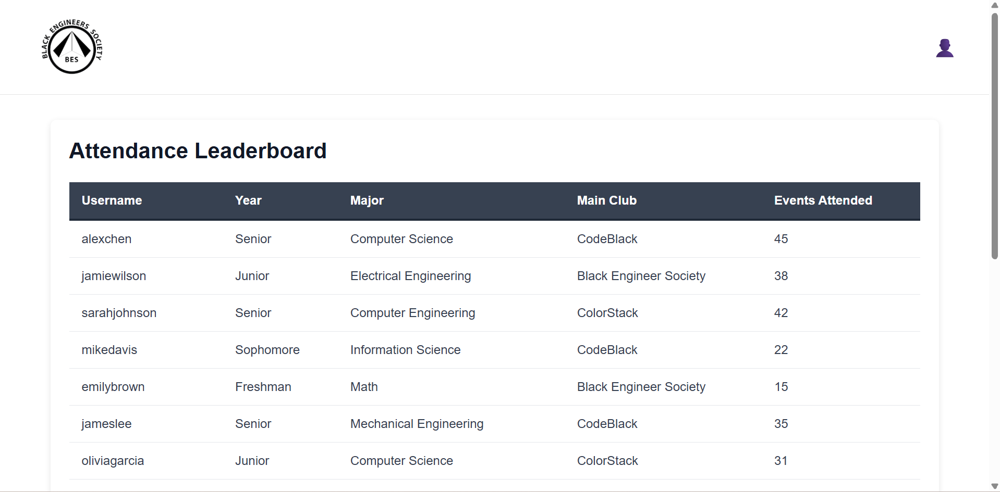
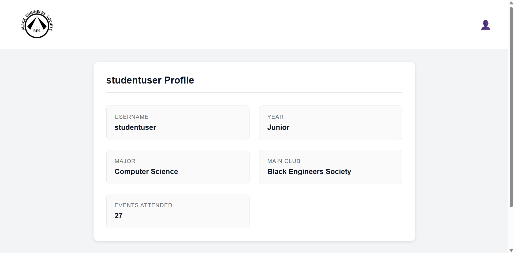

# Attendance Dashboard - HTML & CSS Practice

A vanilla HTML/CSS project for practicing fundamental web development skills.

## Overview

This project helps you practice HTML structure and CSS styling. You'll create styled web pages for an attendance dashboard.

## Learning Objectives

- Semantic HTML structure using `<table>`, `<thead>`, `<tbody>`, `<div>`, and other HTML elements
- CSS styling techniques including flexbox, grid, borders, padding, and hover effects
- How HTML and CSS work together to create styled user interfaces

## How to Run

Open the HTML files in your browser:

1. **Leaderboard page**: Right click on `index.html` and select `Reveal in File Explorer`. Double click on `index.html` and open in browswer.
2. **Profile page**: Right click on `profile.html` and select `Reveal in File Explorer`. Double click on `index.html` and open in browswer.

## Project Structure

```
attendance-dashboard-app/
├── index.html              # Leaderboard page (implement table here)
├── profile.html            # Profile page (implement profile info here)
├── css/
│   └── styles.css         # CSS styles (edit TODO sections)
├── js/
│   ├── data.js            # Mock data (pre-implemented)
│   ├── leaderboard.js     # Leaderboard logic (pre-implemented)
│   └── profile.js         # Profile page logic (pre-implemented)
└── public/
    └── images/
        └── bes-black.png  # Logo image
```

---

## Instructions

### Step 1: Implement the Leaderboard Table

Open `index.html` and add the table structure for the leaderboard inside the `.leaderboard-container` div.

**Requirements:**
- Use a `<table>` element with class `leaderboard-table`
- Use `<thead>` for the header section containing column titles
- Use `<tbody>` with id `leaderboard-body` for the data rows
- The JavaScript will populate the tbody, but you need to create the header row with `<th>` elements
- Column headers should be: Username, Year, Major, Main Club, Events Attended



**Hints:**
- The `<thead>` contains the header row (`<tr>`) with table header cells (`<th>`)
- The `<tbody>` can be empty - the JavaScript will fill it with data
- Remember to close all your tags properly

---

### Step 2: Implement the Profile Page

Open `profile.html` and complete the profile information display.


**Requirements:**
- Inside the `.profile-info-grid` div, create info items for all 5 fields:
  - Username (already done as example)
  - Year
  - Major
  - Main Club
  - Events Attended
- Each info item should use the class `profile-info-item`
- Each label should use the class `profile-info-label`
- Each value should use the class `profile-info-value`

**Hints:**
- Look at the Username example that's already implemented
- Use the same structure for the remaining 4 fields
- The values can be placeholder text for now (the JavaScript will update them)

---

### Step 3: Add CSS Styles

Open `css/styles.css` and complete the TODO sections marked with comments.

#### Leaderboard Styles (Lines 140-176)

You need to style:
1. **Table header row** (`.leaderboard-table thead`)
   - Add a dark background color (try `#374151`)

2. **Header cells** (`.leaderboard-table th`)
   - Add padding: `14px 16px`
   - Align text to the left
   - Make text semi-bold (`font-weight: 600`)
   - Make text white (`color: white`)
   - Add a bottom border: `3px solid #1f2937`

3. **Data cells** (`.leaderboard-table td`)
   - Add padding: `14px 16px`
   - Add a light bottom border: `1px solid #e5e7eb`
   - Set text color to: `#374151`

4. **Table rows** (`.leaderboard-table tbody tr`)
   - Add a smooth transition for hover effects: `background-color 0.2s ease`

5. **Row hover effect** (`.leaderboard-table tbody tr:hover`)
   - Add a light gray background on hover (try `#f3f4f6`)

#### Profile Styles (End of file)

You need to create the grid layout to display:

1. **Profile info grid** (`.profile-info-grid`)
   - Set display to grid
   - Create 2 equal columns: `grid-template-columns: repeat(2, 1fr)`
   - Add gap between items: `1.5rem`

**Hints:**
- Look at the existing CSS rules above the TODO sections for examples
- The property names are the same - you just need to add the values
- Test your changes by refreshing the browser after each edit



---

## Testing Your Implementation

1. Open `index.html` in your browser
2. Verify the table displays with proper styling:
   - Header has a dark background with white text
   - Cells have proper padding and borders
   - Rows highlight on hover
3. Navigate to `profile.html`
4. Verify all 5 profile fields are displayed
5. Verify the profile displays in a 2-column grid layout
6. Check that the profile card is centered on the page

---

## Common CSS Properties Reference

| Property | Description | Example |
|----------|-------------|---------|
| `padding` | Space inside element | `padding: 14px 16px;` |
| `margin` | Space outside element | `margin: 0 auto;` |
| `border` | Element border | `border: 1px solid #e5e7eb;` |
| `border-bottom` | Bottom border only | `border-bottom: 3px solid #1f2937;` |
| `border-radius` | Rounded corners | `border-radius: 8px;` |
| `background-color` | Element background | `background-color: #374151;` |
| `color` | Text color | `color: white;` |
| `font-weight` | Text thickness | `font-weight: 600;` |
| `font-size` | Text size | `font-size: 1.125rem;` |
| `text-align` | Text alignment | `text-align: left;` |
| `border-collapse` | Merge table borders | `border-collapse: collapse;` |
| `display: grid` | CSS Grid layout | `display: grid;` |
| `display: flex` | Flexbox layout | `display: flex;` |
| `grid-template-columns` | Define grid columns | `grid-template-columns: repeat(2, 1fr);` |
| `gap` | Space between grid/flex items | `gap: 1.5rem;` |
| `box-shadow` | Element shadow | `box-shadow: 0 2px 8px rgba(0,0,0,0.1);` |
| `:hover` | Hover state styling | `tr:hover { ... }` |
| `transition` | Smooth animations | `transition: background-color 0.2s ease;` |

---

## Browser Compatibility

This project works in all modern browsers:
- Chrome
- Firefox
- Safari
- Edge

---

## Troubleshooting

**Table not showing data?**
- Make sure your `<tbody>` has the id `leaderboard-body`
- Check the browser console for JavaScript errors (F12 → Console)

**Styles not applying?**
- Check that your CSS selectors match the HTML classes exactly
- Make sure you saved the CSS file and refreshed the browser
- Check the browser console for CSS errors

**Profile grid not working?**
- Do you have the right display attribute?
- Check that the grid-template-columns value is correct

---

## What You Should NOT Modify

These files are pre-implemented and should not be changed:
- `js/data.js` - Contains the mock data
- `js/leaderboard.js` - Handles leaderboard logic
- `js/profile.js` - Handles profile page logic
- The header HTML in both pages

Focus only on:
- Adding HTML structure in `index.html` and `profile.html`
- Adding CSS rules in `css/styles.css` (only in the TODO sections)
